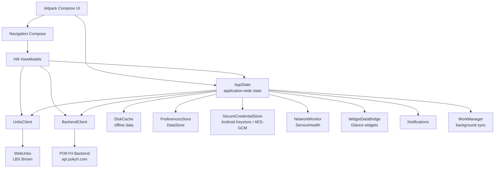
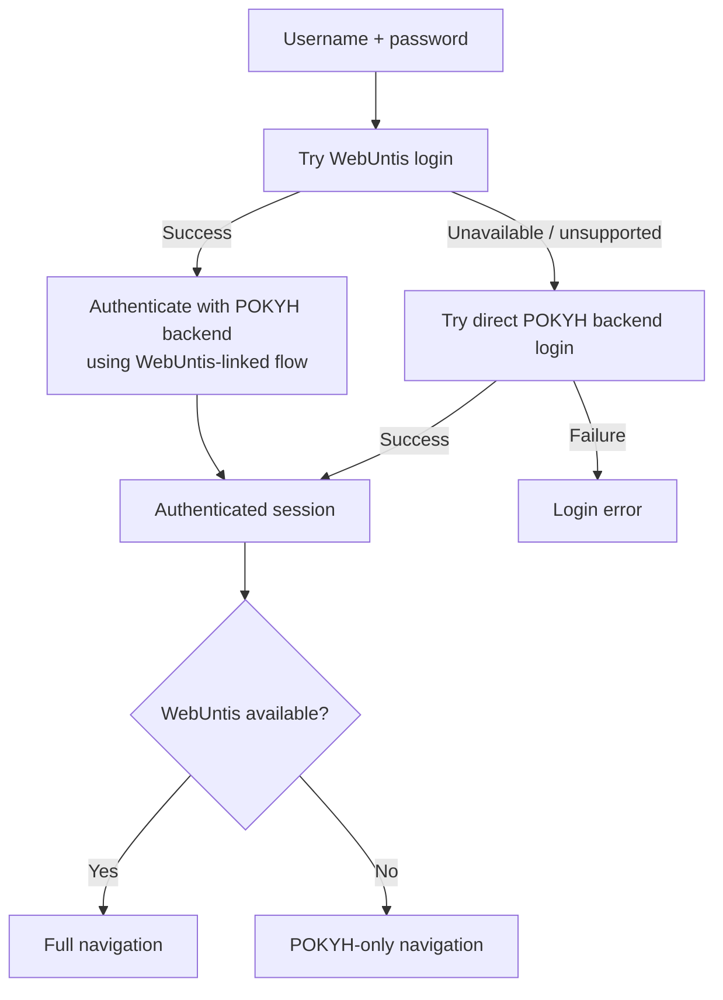

<div align="center">

# POKYH — Android

### Native school companion for LBS Brixen

**Stundenplan · Noten · Mensa · Abwesenheiten · Nachrichten · To-dos · Erinnerungen**

[](https://developer.android.com/)
[](https://kotlinlang.org/)
[](https://developer.android.com/compose)
[](https://github.com/bedchem/POKYH_ANDROID)
[](https://github.com/bedchem/POKYH_ANDROID)

**A fully native Kotlin + Jetpack Compose rewrite of POKYH for Android.**
It combines school data from **WebUntis** with POKYH services such as the cafeteria, to-dos and reminders in one fast, offline-capable application.

[Repository](https://github.com/bedchem/POKYH_ANDROID) · [iOS App](https://github.com/bedchem/POKYH_IOS) · [Legacy Flutter App](https://github.com/bedchem/POKYH)

</div>

> [!IMPORTANT]
> **POKYH Android is currently a work in progress.** The native app already contains the core product architecture and major school features, but interfaces and behavior can still change while development continues.

---

## Table of contents

* [Overview](#overview)
* [Features](#features)
* [Navigation](#navigation)
* [Architecture](#architecture)
* [Tech stack](#tech-stack)
* [Requirements](#requirements)
* [Getting started](#getting-started)
* [Configuration & secrets](#configuration--secrets)
* [Authentication](#authentication)
* [Offline mode](#offline-mode)
* [Widgets, notifications & background work](#widgets-notifications--background-work)
* [In-app updates](#in-app-updates)
* [Release builds & signing](#release-builds--signing)
* [Project structure](#project-structure)
* [Security](#security)
* [Troubleshooting](#troubleshooting)
* [Contributing](#contributing)
* [Related projects](#related-projects)
* [License](#license)

---

## Overview

POKYH for Android is a native school client built for **Landesberufsschule Brixen (LBS Brixen)**.

The app connects to two systems:

| Service                             | Used for                                                                             |
| ----------------------------------- | ------------------------------------------------------------------------------------ |
| **WebUntis**                        | Timetable, grades and other school-related data                                      |
| **POKYH Backend** (`api.pokyh.com`) | Authentication bridge, cafeteria data, to-dos, reminders and POKYH-specific features |

The project is intentionally built as a native Android application instead of continuing the previous Flutter implementation. The production package ID remains compatible with the legacy app so a correctly signed native release can replace an existing Flutter installation rather than appearing as a second app.

The UI is written completely with **Jetpack Compose** and uses a single-activity architecture, Navigation Compose, Hilt dependency injection, WorkManager, DataStore, Android Keystore and Glance widgets.

---

## Features

### 🏠 Home

A central dashboard provides quick access to the most important school information and actions.

* Configurable in-app dashboard widgets
* Quick access to grades, absences, to-dos and reminders
* Upcoming exam/reminder information
* Messages and profile access
* Offline/service-status feedback
* Account switching without leaving the app

### 📅 Stundenplan

A native timetable experience backed by WebUntis.

* Week and day views
* Horizontal paging between weeks/days
* Detailed lesson information
* Subject coloring and status tags
* Exam, substitution and event indicators
* Holiday and empty-state handling
* Cached timetable data for offline use
* Clear stale/offline indicators
* Jump back to the current day
* Calendar week display
* **ICS export** for calendar apps

### 📊 Noten

A dedicated grade dashboard with both overview and subject-level details.

* Overall average
* Subject averages
* Expandable subject rows
* Per-subject detail view
* Grade ratio overview
* Grade distribution
* Recently received grades
* Consistent subject colors shared with the timetable

### 🏫 Schule

The school hub groups additional student workflows into one place.

* ✅ To-dos
* 🔔 Reminders
* 🚫 Absences
* ✉️ Messages
* 📘 Class register events
* 👥 Classroom / class information
* 🔌 Connection status

### 🍽️ Mensa

The cafeteria experience is backed by the POKYH API.

* Current dishes
* Dish images
* Categories and prices
* Descriptions
* Star ratings
* Personal ratings
* Comments
* Allergen information
* Estimated nutrition values per 100 g

  * Calories
  * Protein
  * Carbohydrates
  * Fat
* Cached data where available

### 👥 Accounts & session handling

* Multi-account support
* Fast account switching
* WebUntis-linked accounts
* POKYH-only fallback login
* Capability-aware navigation
* Automatic restoration of saved accounts
* Biometric app lock
* Automatic lock when configured and the app returns from the background

Accounts without a valid WebUntis session can still use supported POKYH functionality. In that case WebUntis-only tabs such as **Stundenplan** and **Noten** are hidden automatically.

### 🔌 Resilient offline mode

The app is designed to remain useful when WebUntis, the POKYH backend or the device connection is temporarily unavailable.

* Persistent disk cache
* Cached-session fallback
* Automatic offline restoration after network/login timeouts
* Background reconnect attempts
* Exponential reconnect backoff
* Silent upgrade from cached session to live session after reconnect
* Stale-data indicators in the UI
* Queued POKYH operations for supported to-do/reminder actions

### 📱 Android integration

* Biometric authentication
* Runtime notification permission handling
* Local reminder notifications
* Periodic background synchronization
* Two Android home-screen widgets
* Native splash screen
* In-app GitHub release updater
* Backend-driven announcement popups
* Material 3 UI
* Edge-to-edge layout

---

## Navigation

POKYH uses one `NavHost` with five main tab roots:

```text
Home
├── Profile
└── Connection status

Stundenplan
└── Lesson details

Schule
├── To-dos
├── Reminders
│   └── Reminder details
├── Absences
├── Messages
│   └── Message details
├── Class register events
└── Classroom

Noten
└── Subject details

Mensa
└── Dish details
```

The app uses separate motion patterns for navigation:

* **Tab switches:** crossfade
* **Push/pop navigation:** slide + fade

`Stundenplan` and `Noten` are shown only when the active account has WebUntis capabilities.

---

## Architecture

POKYH combines a central application state with screen-level Hilt ViewModels and dedicated network/storage components.



### Core architectural decisions

**Single activity**
`MainActivity` hosts the Compose application and uses `FragmentActivity` so AndroidX `BiometricPrompt` can be used directly.

**Central `AppState`**
Authentication state, the active account, account switching, offline restoration and auto-lock behavior are coordinated by one application-scoped Hilt singleton.

**Screen-level ViewModels**
Feature screens keep their own UI state while receiving shared application state and services through Hilt.

**Separate remote services**
`UntisClient` communicates with the school's WebUntis instance while `BackendClient` handles POKYH-specific backend calls.

**Persistent local state**
Preferences, encrypted credentials and offline cache data are intentionally separated instead of being stored in one shared persistence layer.

---

## Tech stack

| Area                  | Technology                       |
| --------------------- | -------------------------------- |
| Language              | **Kotlin 2.4.20**                |
| Android Gradle Plugin | **AGP 9.1.0**                    |
| Build system          | **Gradle 9.7.1**                 |
| UI                    | **Jetpack Compose + Material 3** |
| Compose BOM           | **2026.06.01**                   |
| Navigation            | **Navigation Compose 2.10.0**    |
| Dependency injection  | **Hilt 2.60.1**                  |
| Code generation       | **KSP 2.3.12**                   |
| Networking            | **OkHttp 5.5.0**                 |
| Serialization         | **kotlinx.serialization 1.11.0** |
| Date & time           | **kotlinx-datetime 0.8.0**       |
| Images                | **Coil 3.6.2**                   |
| Preferences           | **DataStore 1.2.1**              |
| Background work       | **WorkManager 2.11.2**           |
| App widgets           | **Glance 1.2.0**                 |
| Biometrics            | **AndroidX Biometric**           |
| Java toolchain        | **Java 17**                      |
| Minimum Android       | **API 26 / Android 8.0**         |
| Compile / target SDK  | **API 37**                       |

---

## Requirements

Before building the project, make sure you have:

* Android Studio with support for the current Android Gradle Plugin
* **JDK 17**
* Android SDK **API 37**
* A device/emulator running **Android 8.0 (API 26)** or newer
* Access to the required POKYH backend credentials
* Internet access for live WebUntis/POKYH data

You do **not** need a separately installed Gradle version; use the included Gradle Wrapper.

---

## Getting started

### 1. Clone the repository

```bash
git clone https://github.com/bedchem/POKYH_ANDROID.git
cd POKYH_ANDROID
```

### 2. Create local configuration

```bash
cp local.properties.example local.properties
```

Then edit `local.properties`:

```properties
sdk.dir=/path/to/Android/Sdk

POKYH_API_KEY=your_api_key
POKYH_SERVER_KEY=your_server_key
```

The API and server keys must match the POKYH backend configuration.

> [!CAUTION]
> Never commit `local.properties`, keystores or real credentials. The file is intended to remain local and is gitignored.

### 3. Build the debug APK

macOS / Linux:

```bash
./gradlew :app:assembleDebug
```

Windows:

```powershell
.\gradlew.bat :app:assembleDebug
```

The debug APK is generated below:

```text
app/build/outputs/apk/debug/
```

### 4. Install on a connected device

```bash
./gradlew :app:installDebug
```

You can also open the repository directly in Android Studio and run the `app` configuration.

---

## Configuration & secrets

The project reads local values from `local.properties` first and then falls back to environment variables.

### Required values

| Key                | Purpose                                                |
| ------------------ | ------------------------------------------------------ |
| `POKYH_API_KEY`    | Client API key expected by the POKYH backend           |
| `POKYH_SERVER_KEY` | Server/trusted integration key expected by the backend |

### Optional release-signing values

| Key                       | Purpose                  |
| ------------------------- | ------------------------ |
| `POKYH_KEYSTORE_PATH`     | Path to release keystore |
| `POKYH_KEYSTORE_PASSWORD` | Keystore password        |
| `POKYH_KEY_ALIAS`         | Signing key alias        |
| `POKYH_KEY_PASSWORD`      | Signing key password     |

Example:

```properties
POKYH_KEYSTORE_PATH=/secure/path/pokyh.jks
POKYH_KEYSTORE_PASSWORD=...
POKYH_KEY_ALIAS=...
POKYH_KEY_PASSWORD=...
```

### Built-in project endpoints

The Android build currently targets:

```text
POKYH backend:  https://api.pokyh.com
WebUntis:       https://lbs-brixen.webuntis.com/WebUntis
School:         lbs-brixen
Update repo:    bedchem/POKYH_ANDROID
```

> [!NOTE]
> Values injected into an Android APK at build time can ultimately be extracted from a distributed client. Do not treat client-side values as a replacement for proper server-side authorization and access control.

---

## Authentication

The authentication flow supports both WebUntis-linked and POKYH-only accounts.



Saved credentials are not stored in regular DataStore preferences. The project separates them into `SecureCredentialStore`, which uses Android Keystore-backed AES-GCM encryption.

---

## Offline mode

Offline behavior is coordinated centrally by `AppState`.

When a saved account exists, the app can race a live login attempt against cached data. If the network is unavailable or authentication services respond too slowly, POKYH can enter a cached offline session instead of blocking the user indefinitely.

The app then continues reconnecting in the background. Once a valid live session becomes available, it can replace the cached session without requiring the user to log in again.

### Data handling

* Cached school/app data is persisted in `DiskCache`
* Saved account metadata and preferences live in DataStore
* Login credentials are encrypted separately
* Offline session snapshots remove live bearer/API/session tokens before persistence
* Network state and backend/WebUntis health are surfaced to the UI
* Screens mark stale/cached data where relevant

This makes the offline cache a fallback for usability without treating old data as live data.

---

## Widgets, notifications & background work

### Android home-screen widgets

The app currently ships with two Glance widgets:

| Widget                     | Purpose                 |
| -------------------------- | ----------------------- |
| **POKYH – Nächste Stunde** | Shows the next lesson   |
| **POKYH – Noten**          | Shows grade information |

### Notifications

The application supports reminder notifications and requests `POST_NOTIFICATIONS` only after a successful login on Android versions that require runtime permission.

Relevant Android capabilities include:

```text
POST_NOTIFICATIONS
SCHEDULE_EXACT_ALARM
RECEIVE_BOOT_COMPLETED
```

### Background work

POKYH initializes WorkManager with a Hilt-aware worker factory rather than using WorkManager's default initializer.

Background responsibilities include periodic notification/data synchronization and keeping relevant app/widget state fresh.

---

## In-app updates

POKYH contains a native updater backed by **GitHub Releases**.

The updater checks:

```text
https://api.github.com/repos/bedchem/POKYH_ANDROID/releases/latest
```

A release is considered installable only when:

1. It is newer than the currently installed app version
2. It is not a draft
3. It is not a prerelease
4. It contains an `.apk` asset

The APK is downloaded into the app cache and validated before Android's package installer is opened.

The updater verifies that:

* The APK can be parsed
* The package name matches the currently installed app
* The APK has a higher `versionCode`

Android still asks the user to approve the install, and Android's package manager enforces signing compatibility when replacing an existing installation.

### Publishing an update

The expected release workflow is:

```text
1. Bump appVersionName in app/build.gradle.kts
2. Build the release APK
3. Create a Git tag/release such as v2.0.1
4. Attach the .apk to the GitHub Release
5. Publish the release (not draft/prerelease)
```

The in-app updater compares the GitHub tag with `BuildConfig.VERSION_NAME`.

---

## Release builds & signing

### Versioning

The current application version is:

```text
2.0.0
```

`versionCode` is derived automatically from semantic version components:

```text
2.0.1  ->  20001
2.1.0  ->  20100
3.0.0  ->  30000
```

This avoids accidentally forgetting to bump `versionCode`.

### Legacy Flutter compatibility

The production application ID is intentionally:

```text
dev.plattnericus.project
```

while the Kotlin namespace is:

```text
dev.plattnericus.pokyh
```

The production ID is preserved from the former Flutter application so the native Android app can install **as an update** over the old app.

The debug variant receives the normal debug application ID suffix and can therefore coexist separately during development.

### Signing compatibility

The release build preserves compatibility with the signing identity used by published POKYH APKs. The build supports overriding the signing configuration through the `POKYH_KEYSTORE_*` values shown above.

> [!WARNING]
> If an APK is signed with a different key, Android will not allow it to update an already installed production POKYH app with the same package ID. Keep the official signing key backed up and do not rotate it accidentally.

Build a release with:

```bash
./gradlew :app:assembleRelease
```

Release APKs are written below:

```text
app/build/outputs/apk/release/
```

Release builds enable code shrinking, resource shrinking and ProGuard/R8 processing.

---

## Project structure

A simplified view of the repository:

```text
POKYH_ANDROID/
├── app/
│   ├── build.gradle.kts
│   └── src/main/
│       ├── AndroidManifest.xml
│       ├── java/dev/plattnericus/pokyh/
│       │   ├── core/
│       │   │   ├── notifications/
│       │   │   ├── update/
│       │   │   └── widgets/
│       │   ├── data/
│       │   ├── state/
│       │   │   └── AppState.kt
│       │   ├── ui/
│       │   │   ├── absences/
│       │   │   ├── classreg/
│       │   │   ├── classroom/
│
```
